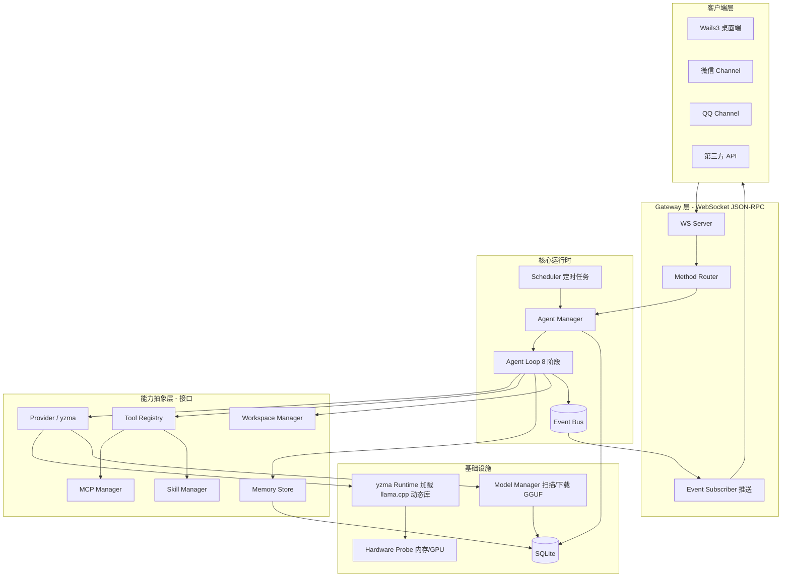
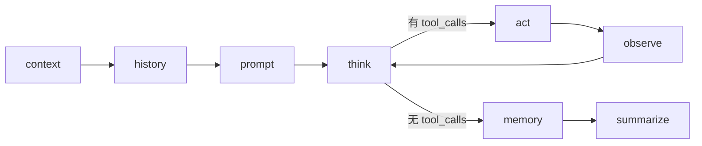
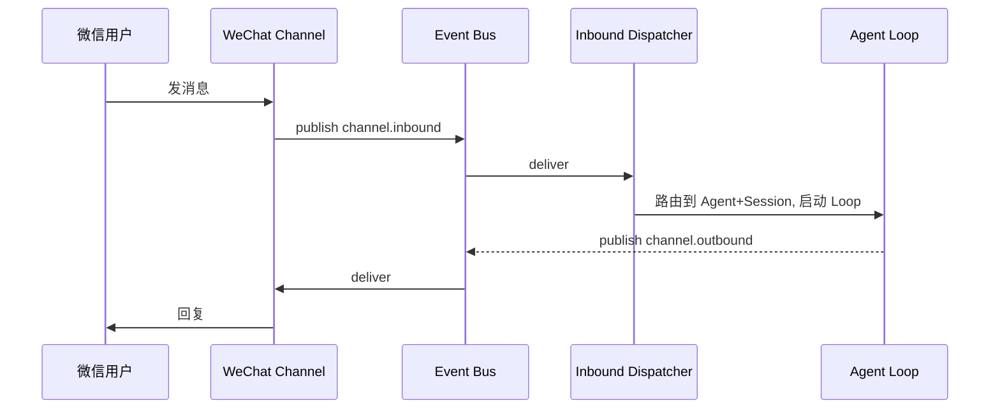
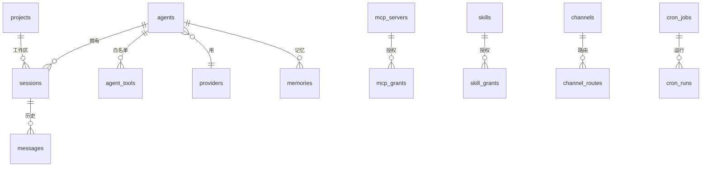

# Nurvis — 本地优先的多 Agent 运行时

> 一个类 OpenClaw 的本地优先 Agent 平台。核心通过 [yzma](https://github.com/hybridgroup/yzma) 在进程内直接调用 `llama.cpp` 进行本地推理，**数据不离电脑**；同时支持用户创建多个 Agent，为不同任务（编程 / 画图 / 设计等）绑定不同模型、工具、工作区与对话渠道。

---

# 重要
- 该文档可以随着项目的演进自动更新，避免文档腐败。
- 开发中使用`go mod vendor`来管理依赖，方便检索代码。
- 环境变量使用 `NURVIS` 前缀。
- 调试桌面软件可以使用`make desktop-dev`来启动。
- 后台内置的提示词都使用英文。
- 代码注释都使用英文。
- 单文件的代码尽量不要超过1000行，前后端都是。

## 1. 设计目标

- **本地优先 / 隐私**：默认所有推理在 Nurvis 进程内通过 yzma 调用 `llama.cpp` 完成，会话、配置、记忆全部落地 SQLite，不上传云端、不需要任何外部模型服务进程。
- **可扩展抽象**：核心能力（Provider / Tool / Channel / Skill / MCP / Memory / Scheduler）全部面向接口编程，新增实现不改主流程。
- **多 Agent 多任务**：每个 Agent 是「模型 + 系统提示 + 工具集 + 默认工作区 + 渠道」的组合，互相隔离。
- **统一网关**：交互收敛 WebSocket JSON-RPC Gateway，桌面软件可以部分使用 wails3 的函数接口。
- **可观测**：每次 Agent Loop 的 8 个阶段都产生事件，经事件总线广播，便于流式 UI 与排障。
- **桌面软件**：使用 [wails3](https://v3.wails.io/quick-start/why-wails/) 实现桌面软件。

---

## 2. 技术栈

| 维度 | 选型 | 说明 |
|------|------|------|
| 语言 | Go 1.22+ | 适当使用泛型（Registry、EventBus、Result[T]） |
| 存储 | SQLite（`modernc.org/sqlite`，纯 Go，免 CGO） | 配置 + 会话 + 记忆 + 任务 |
| 迁移 | `golang-migrate` 或自研 embed 迁移 | schema 版本化 |
| 网关 | WebSocket（`coder/websocket`）+ JSON-RPC 2.0 | 单一入口 |
| LLM 推理 | [yzma](https://github.com/hybridgroup/yzma) + `llama.cpp` 动态库 | 进程内推理，purego，免 CGO |
| 模型来源 | HuggingFace Hub（`*.gguf`） | 直接 `https://huggingface.co/<repo>/resolve/main/<file>.gguf` 下载 |
| Tool calling 解析 | `github.com/hybridgroup/yzma/pkg/message`（`ParseToolCalls`） | 支持 Standard / Qwen / GLM / Mistral / Gemma / GPT / Phi-4 等格式 |
| MCP | 官方 `mcp-go` SDK（stdio / SSE / Streamable HTTP） | 工具扩展 |
| 调度 | `robfig/cron/v3` | 定时任务 |
| 渠道 | 微信、QQ（先接入） | 见 §10 |
| 桌面（二阶段） | Wails3 | 复用 Gateway 协议 |

---

## 3. 整体架构



要点：
- **Gateway 不含业务逻辑**，只做协议解析、鉴权、路由、把内部事件推给订阅者。
- **能力抽象层全是接口**，主流程（Agent Loop）只依赖接口，不依赖具体实现。
- **Event Bus 是中枢**：Loop 各阶段、Channel 入站消息、Scheduler 触发都通过它流转。
- **推理在进程内**：yzma Runtime 通过 `purego` 加载 `llama.cpp` 动态库，没有外部 server 进程，也不需要 HTTP 协议层。

---

## 4. 目录结构

```
nurvis/
├── cmd/
│   ├── nurvisd/main.go            # 守护进程入口（启动 Gateway + 后台服务）
│   └── nurvis-desktop/            # Wails3 桌面端入口
│       ├── main.go
│       └── app.go
├── internal/
│   ├── app/app.go                 # 依赖装配 (wiring)、生命周期
│   ├── gateway/
│   │   ├── server.go              # WS server
│   │   ├── methods.go             # JSON-RPC 方法路由
│   │   └── middleware.go          # 鉴权等中间件
│   ├── agent/
│   │   ├── manager.go             # Agent CRUD、实例缓存
│   │   ├── loop.go                # 8 阶段编排
│   │   └── stages/                # context/history/prompt/think/act/observe/memory/summarize
│   ├── provider/
│   │   ├── provider.go            # Provider 接口
│   │   ├── yzma.go                # 本地 yzma Provider 实现（默认）
│   │   ├── openai.go              # OpenAI 兼容实现（远程模型可选）
│   │   └── yzma_test.go
│   ├── llamax/                    # yzma Runtime 封装（进程内单例）
│   │   ├── runtime.go             # llama.Load / Init / Close 全局生命周期
│   │   ├── engine.go              # Engine: 模型加载 + 流式 Chat 生成
│   │   ├── sampler.go             # 采样参数转换
│   │   ├── template.go            # Chat template 渲染（gemma/qwen/chatml...）
│   │   └── tools.go               # 工具调用解析（封装 yzma message.ParseToolCalls）
│   ├── modelmgr/                  # 本地 GGUF 模型管理（替代 ollama 进程管理）
│   │   ├── manager.go             # 扫本地模型目录 / 删除 / 元数据
│   │   ├── download.go            # HuggingFace GGUF 下载（断点续传 + 进度）
│   │   ├── library.go             # HuggingFace 推荐模型清单（默认精选 + 可扩展）
│   │   └── llamacpp.go            # 首次启动自动 yzma download.LlamaInstall 到 ~/.nurvis/lib
│   ├── hardware/hardware.go       # 内存/GPU 探测 + 模型推荐
│   ├── tool/
│   │   ├── tool.go                # Tool 接口 + Registry
│   │   └── builtin/               # 内置工具
│   │       ├── register.go
│   │       ├── exec.go            # 命令执行
│   │       ├── fs.go              # 文件读写
│   │       └── http.go            # HTTP 请求
│   ├── mcp/manager.go             # MCP Manager（client 连接、工具注册到 Registry）
│   ├── skill/manager.go           # Skill Manager（加载、授权、转 Tool）
│   ├── workspace/workspace.go     # Workspace/Project 管理（本地目录）
│   ├── memory/store.go            # 会话历史 + 长期记忆
│   ├── bus/
│   │   ├── bus.go                 # 泛型 Event Bus
│   │   └── topics.go              # 主题常量
│   ├── scheduler/scheduler.go     # cron 定时任务
│   ├── channel/
│   │   ├── channel.go             # Channel 接口
│   │   ├── dispatcher.go          # 入站调度（去重/防抖/路由）
│   │   ├── wechat/channel.go      # 微信 Channel 实现
│   │   └── qq/channel.go          # QQ Channel 实现
│   ├── store/
│   │   ├── store.go               # SQLite 封装
│   │   ├── migrations/             # *.sql schema 迁移
│   │   └── repo/                  # 各实体 Repository（DAO）
│   │       ├── repo.go
│   │       ├── agent.go
│   │       ├── builtin_tool.go
│   │       ├── channel.go
│   │       ├── cron.go
│   │       ├── mcp.go
│   │       ├── memory.go
│   │       ├── message.go
│   │       ├── project.go
│   │       ├── session.go
│   │       └── skill.go
│   └── version/version.go         # 版本信息
├── frontend/
│   ├── index.html
│   ├── embed.go                   # Go embed 前端资源
│   ├── package.json
│   ├── vite.config.ts
│   ├── tsconfig.json
│   ├── public/
│   ├── bindings/                  # Wails3 生成的 TS 绑定
│   └── src/
│       ├── main.tsx
│       ├── App.tsx                # 根组件（连接→引导→主界面）
│       ├── index.css              # Tailwind + OKLCH 设计体系
│       ├── lib/
│       │   ├── ws.ts              # WebSocket JSON-RPC 客户端
│       │   └── constants.ts       # WS_URL / API_BASE
│       ├── types/
│       │   ├── index.ts           # Agent / Session / Message 等类型
│       │   └── wails-bindings.d.ts
│       ├── stores/
│       │   ├── ui-store.ts        # theme / view / activeAgentId
│       │   └── chat-store.ts      # messages / isRunning / 流式状态
│       ├── hooks/
│       │   ├── use-agents.ts
│       │   ├── use-sessions.ts
│       │   ├── use-chat.ts        # WS 事件订阅 + sendMessage + abort
│       │   └── use-runtime.ts     # 硬件 / runtime 状态 / 模型推荐
│       ├── services/              # API 服务封装
│       └── components/
│           ├── ui/index.tsx       # Button / Input / Textarea / Spinner
│           ├── common/            # 通用业务组件
│           ├── onboarding/
│           │   ├── OnboardingWizard.tsx
│           │   ├── SetupStep.tsx
│           │   └── AgentCreateStep.tsx
│           ├── agents/
│           │   ├── AgentPanel.tsx
│           │   └── AgentFormDialog.tsx
│           ├── chat/
│           │   ├── ChatCanvas.tsx
│           │   ├── MessageBubble.tsx
│           │   └── InputBar.tsx
│           └── layout/
│               ├── AppShell.tsx
│               └── Sidebar.tsx
├── go.mod
├── Makefile
├── Taskfile.yml
└── AGENTS.md
```

---

## 5. 核心抽象（接口）

可扩展性的关键：所有能力都收敛为少量稳定接口，主流程只依赖接口。新增模型供应商、工具、渠道时只实现接口并注册，无需改 Loop。

### 5.1 Provider — LLM 抽象

```go
package provider

type Message struct {
    Role      string         `json:"role"`    // system|user|assistant|tool
    Content   string         `json:"content"`
    ToolCalls []ToolCall     `json:"tool_calls,omitempty"`
    Images    []string       `json:"images,omitempty"` // base64, 多模态（VLM）
    Name      string         `json:"name,omitempty"`   // tool 消息对应的工具名
}

type ChatRequest struct {
    Model    string         // GGUF 模型在本地目录中的标识（HF repo 路径或文件名）
    Messages []Message
    Tools    []ToolSchema   // 暴露给模型的工具 JSON Schema
    Stream   bool
    Options  map[string]any // temperature, num_ctx, top_p 等
}

// Chunk 流式增量；非流式时整体返回一个 Chunk。
type Chunk struct {
    Content   string
    ToolCalls []ToolCall   // 仅在 Done=true 时填充（解析自完整文本）
    Done      bool
    Usage     *Usage
}

// Provider 屏蔽不同后端差异；一阶段默认实现 yzma（本地），
// 接口预留 OpenAI 兼容等扩展（远程模型）。
type Provider interface {
    Name() string
    Chat(ctx context.Context, req ChatRequest) (<-chan Chunk, error)
    // Embed 一阶段不在本地 yzma 实现（memory 模块暂不依赖向量检索）；
    // 远程 OpenAI 兼容 Provider 可实现该方法。
    Embed(ctx context.Context, model, text string) ([]float32, error)
    ListModels(ctx context.Context) ([]ModelInfo, error)
}
```

### 5.2 Tool — 工具抽象（内置 / MCP / Skill 统一）

```go
package tool

type Result struct {
    Content  string         // 给模型看的文本
    Media    []Artifact     // 产物（图片/文件）
    IsError  bool
    Meta     map[string]any
}

type Tool interface {
    Name() string
    Description() string
    Schema() ToolSchema           // JSON Schema 入参
    Invoke(ctx context.Context, args map[string]any, scope Scope) (*Result, error)
}

// Scope 注入运行时上下文：当前工作区、agent、session。
type Scope struct {
    WorkspaceDir string
    AgentID      string
    SessionID    string
}
```

泛型 Registry，统一管理三类工具来源（内置、MCP、Skill）：

```go
type Registry struct { /* mu + map[string]Tool */ }
func (r *Registry) Register(t Tool) error
func (r *Registry) Get(name string) (Tool, bool)
func (r *Registry) Schemas(allow []string) []ToolSchema  // 按 agent 白名单过滤
```

> MCP 工具、Skill 都被适配（adapter）成 `Tool` 注册进同一个 Registry，Loop 无需区分来源。

### 5.3 Channel — 对话渠道抽象

```go
package channel

type Inbound struct {
    ChannelID string       // 实例 ID
    Type      string       // wechat|qq
    From      Identity     // 发信人（用户/群）
    Text      string
    Media     []Artifact
    Ts        time.Time
}

type Outbound struct {
    To    Identity
    Text  string
    Media []Artifact
}

type Channel interface {
    Type() string
    Start(ctx context.Context, in chan<- Inbound) error // 把入站消息投递到 bus
    Send(ctx context.Context, out Outbound) error
    Stop() error
}
```

### 5.4 泛型 Event Bus

```go
package bus

type Event[T any] struct {
    Topic string
    Data  T
    Ts    time.Time
}

type Bus interface {
    Publish(topic string, data any)
    Subscribe(topics ...string) (<-chan Envelope, func()) // 返回取消订阅函数
}
```

主题约定（topic 命名空间）：
`agent.run.*`、`agent.stage.*`、`tool.*`、`channel.inbound`、`channel.outbound`、`cron.fired`、`runtime.*`（含 `runtime.lib.progress`）、`models.pull.progress`。

---

## 6. Agent Loop — 8 阶段

一次用户消息触发一轮 Loop。Loop 是一个有状态的管线，8 个阶段顺序执行；`think→act→observe` 可循环多轮直到模型不再请求工具或达到最大轮次。



| 阶段 | 职责 | 关键输入/输出 |
|------|------|---------------|
| **context** | 装配运行上下文：解析本轮使用的 Agent、Workspace（可对话时临时指定）、可用工具白名单、模型参数 | 输出 `RunContext` |
| **history** | 从 SQLite 拉取会话历史，做 token 预算裁剪（保留 system + 最近 N 轮 + 摘要） | 输出 `[]Message` |
| **prompt** | 组装系统提示：Agent 人设 + 工作区信息 + 工具说明（JSON Schema 注入） + 长期记忆注入 | 输出最终 `ChatRequest` |
| **think** | 调用 Provider 流式推理，逐 token 经 bus 推给前端；生成结束后解析 `tool_calls` | 输出文本增量 + 工具调用列表 |
| **act** | 执行工具调用（多调用可并行），统一通过 Tool Registry，注入 Scope | 输出各 `tool.Result` |
| **observe** | 把工具结果回填为 `tool` 角色消息，判断是否需要再次 think（是则回到 think） | 控制循环 |
| **memory** | 落库本轮完整消息；按规则抽取长期记忆（偏好/事实）写入 memory store | 持久化 |
| **summarize** | 当历史超阈值时生成滚动摘要，压缩 token；更新 session 摘要 | 持久化摘要 |

设计要点：
- 每个阶段实现统一接口 `Stage interface{ Run(ctx, *RunState) error }`，Loop 持有 `[]Stage`，便于插桩、替换、测试。
- 每进入/离开一个阶段发 `agent.stage.{name}.{start|end}` 事件。
- `act` 阶段使用 `errgroup` 并行执行多个工具，结果按原始下标排序回填（参考旧实现的 `indexedResult`）。
- 取消：`context.Context` 贯穿全程，`chat.abort` 触发 cancel；本地推理循环每生成一个 token 检查一次 `ctx.Err()`。

```go
type RunState struct {
    Ctx       RunContext
    Messages  []provider.Message
    ToolCalls []provider.ToolCall
    Output    strings.Builder
    Round     int
    MaxRounds int
}
```

---

## 7. 本地推理（yzma + llama.cpp） + 硬件探测 + 模型管理

### 7.1 yzma Runtime（`internal/llamax`）

进程内单例，负责 `llama.cpp` 动态库的加载与全局生命周期。**不需要任何外部进程**。

```go
type Runtime interface {
    EnsureReady(ctx context.Context) error // 首启自动下载 llama.cpp 库 + llama.Load + llama.Init
    LibPath() string                       // 当前使用的 lib 目录
    Close() error                          // 进程退出时调用 llama.Close
    LoadModel(path string, opts ModelOptions) (*Engine, error) // 加载一个 GGUF 模型
}

type Engine interface {
    Chat(ctx context.Context, req provider.ChatRequest) (<-chan provider.Chunk, error)
    Close() error
}
```

- 默认 lib 目录：`~/.nurvis/lib`（可被 `NURVIS_LIB` 覆盖）。
- `EnsureReady` 流程：
  1. 检测 `LibPath()` 下是否已有 `llama.cpp` 库；
  2. 若没有，调用 yzma 的 `pkg/download` 自动下载与本机 OS/Arch/GPU 匹配的预编译动态库（macOS arm64 → Metal；Linux/Win → CUDA / Vulkan / CPU 自动挑选），过程经 bus 推 `runtime.lib.progress`；
  3. `llama.Load(libPath)` + `llama.Init()`；进程退出统一 `llama.Close`。
- `Engine` 内部维护单模型上下文 `(model, ctx, sampler, vocab)`；`Chat` 内做：
  - 用模型自带 chat template（`llama.ModelChatTemplate`）渲染 `messages`；若模型未携带，回退 `chatml`；
  - `Tokenize → BatchGetOne → Decode → SamplerSample → TokenToPiece` 循环逐 token 输出，并把每个 piece 作为 `Chunk{Content: piece}` 发送到返回通道；
  - 命中 `VocabIsEOG` 或 `ctx.Err()` 退出循环，最后一次发送 `Chunk{Done: true, ToolCalls: <解析结果>}`。
- 模型缓存策略：Engine 按 `(model_path, ctx_size)` 缓存；同一模型并发会话串行使用同一 `llama.Context`（以 token 队列的方式串行），避免重复加载。模型切换 = 释放旧 Engine + 加载新 Engine。

### 7.2 yzma Provider（`internal/provider/yzma.go`）

`Provider` 的默认实现，核心职责：

```go
type YzmaProvider struct {
    rt   llamax.Runtime
    mgr  modelmgr.Manager
    pool *enginePool // 已加载的 Engine 缓存
}

func (p *YzmaProvider) Chat(ctx context.Context, req ChatRequest) (<-chan Chunk, error) {
    eng, err := p.pool.GetOrLoad(ctx, req.Model)
    if err != nil { return nil, err }
    return eng.Chat(ctx, req)
}
```

- `req.Model` 取值规则：本地 GGUF 文件名（如 `gemma-3-4b-it-Q4_K_M.gguf`）或 HF 风格路径（如 `ggml-org/gemma-3-4b-it-GGUF/gemma-3-4b-it-Q4_K_M.gguf`）；`ModelManager` 负责解析为本地绝对路径。
- `Embed` 在本地实现中返回 `ErrNotImplemented`（一阶段 memory 不依赖向量）。

### 7.3 Tool calling 解析（`internal/llamax/tools.go`）

llama.cpp 直接输出 token 文本，没有结构化 `tool_calls` 字段。Nurvis 直接复用 yzma 的多格式解析器：

```go
import "github.com/hybridgroup/yzma/pkg/message"

func ParseToolCalls(full string) []provider.ToolCall {
    raw := message.ParseToolCalls(full) // 自动识别 Standard / Qwen / GLM / Mistral / Gemma / GPT / Phi-4 / inline-JSON
    // ... 转成 provider.ToolCall
}
```

支持的格式覆盖（来自 yzma `pkg/message/parser.go`）：
- **Standard**：`<tool_call>{...}</tool_call>` 包裹（Qwen、Llama-3.x 工具微调版常见）
- **Qwen**：`<function=name>...</function>` 块（含散落在文本中的多块）
- **Gemma**：内联裸 JSON `{"name":"...","args":{...}}`
- **GLM / Mistral / GPT / Phi-4**：各自的封装格式
- 健壮性：`repairJSON` 自动补全截断的大括号 / 中括号

> 一阶段先以 Gemma、Qwen 两族为主验证；其它格式得益于 yzma 的统一解析器，可以零额外代码支持。

### 7.4 ModelManager（`internal/modelmgr`）

不再托管任何外部进程，只做**本地 GGUF 文件管理**：

```go
type Manager interface {
    Dir() string                                  // ~/.nurvis/models
    List(ctx context.Context) ([]ModelInfo, error) // 扫目录 + 读 GGUF 头
    Resolve(model string) (path string, err error) // 把逻辑名解析为本地绝对路径
    Pull(ctx context.Context, ref ModelRef) (<-chan PullProgress, error) // 从 HF 下载
    Delete(ctx context.Context, model string) error
    ListLibrary(ctx context.Context) ([]LibraryModel, error) // 推荐清单
}

type ModelRef struct {
    Repo string // e.g. "ggml-org/gemma-3-4b-it-GGUF"
    File string // e.g. "gemma-3-4b-it-Q4_K_M.gguf"
}
```

下载实现要点：
- URL 模板：`https://huggingface.co/{Repo}/resolve/main/{File}`；
- 复用旧 `download.go` 的分块流式 + Range 续传 + 重试；进度通过 `models.pull.progress` 事件投递。
- 文件落地：`~/.nurvis/models/{Repo}/{File}`（Repo 中 `/` 保留为子目录）。
- 本地存在时 `Pull` 直接走 “already present” 短路。
- 推荐库（`ListLibrary`）：一阶段使用内置精选 JSON（gemma3 / qwen2.5 / llama3.2 / phi-3.5 等几十条），后续可改为查 HuggingFace search API。

### 7.5 硬件探测与模型推荐

```go
type HardwareInfo struct {
    TotalRAMBytes uint64
    GPUs          []GPU   // 厂商、显存
    Platform      string  // darwin/linux/windows, arm64/amd64
}

func Probe() (HardwareInfo, error)
func Recommend(hw HardwareInfo) []ModelRecommend // 按显存/内存给出可运行的 GGUF 模型档位
```

- macOS（Apple Silicon）：统一内存，按总内存推荐；Linux/Win 优先看独立 GPU 显存。
- **默认模型 `gemma-3-4b-it-Q4_K_M.gguf`**（HF repo：`ggml-org/gemma-3-4b-it-GGUF`）。推荐档位示例：
  - < 8GB → `gemma-3-1b-it-Q4_K_M`（`ggml-org/gemma-3-1b-it-GGUF`）/ `Qwen2.5-1.5B-Instruct-Q4_K_M`
  - 8–16GB → `gemma-3-4b-it-Q4_K_M`（默认）
  - 16–32GB → `gemma-3-12b-it-Q4_K_M` / `Qwen2.5-7B-Instruct-Q4_K_M`
  - > 32GB → `gemma-3-27b-it-Q4_K_M`
- 首次启动流程：
  1. `llamax.Runtime.EnsureReady`：自动下载 `llama.cpp` 动态库到 `~/.nurvis/lib`；
  2. `hardware.Probe` + `Recommend`；
  3. 用户在引导页选定模型 → `modelmgr.Pull` → 完成。

---

## 8. Workspace / Project 管理

- **Project** = 一个本地目录（工作区）+ 元信息。不同项目隔离不同的工作目录。
- Agent 绑定一个**默认工作区**；对话时可在 `chat.send` 参数里临时**指定工作区**覆盖默认值。
- 工具执行通过 `Scope.WorkspaceDir` 拿到当前工作目录，文件类工具在此根目录下做路径约束（防越界）。

```go
type WorkspaceManager interface {
    Create(name, dir string) (*Project, error)
    List() ([]Project, error)
    Resolve(projectID string) (*Project, error) // 校验目录存在/可写
}
```

---

## 9. MCP / Skill / 内置工具

三者统一适配为 `tool.Tool` 注册进 Registry：

- **内置工具**：`read_file/write_file/list_files`、`exec`（在工作区内执行命令）、`web_fetch`、`image.gen`（对接本地出图模型）等。每个工具可全局启用/禁用。
- **MCP**：MCP Manager 连接 stdio/SSE/HTTP server，拉取其 tool 列表，逐个包成 `Tool`（名字加 `mcp_<server>_` 前缀防冲突），运行时把入参透传、结果回收。支持按 Agent 授权（grant）。
- **Skill**：Skill 是「指令 + 脚本 + 资源」的目录包。Skill Manager 加载 manifest，将其暴露为一个可调用 `Tool`（或注入到 prompt 的能力清单）。支持上传、启用、按 Agent 授权。

> Agent 通过 `allowed_tools` 白名单决定可见哪些工具，Registry 的 `Schemas(allow)` 据此过滤。

---

## 10. Channels（微信 / QQ 优先）

- 每个 Channel 实例独立配置，`Start` 后把入站消息投递到 bus 的 `channel.inbound`。
- 一个**入站调度器**消费 `channel.inbound`：按「渠道+发信人」映射到目标 Agent + Session，触发 Agent Loop；Loop 产出经 `channel.outbound` 回投给对应 Channel 的 `Send`。
- **微信**：优先采用可控的协议网关（如 Gewechat / 个人号网关）适配为 `Channel`；接口隔离，后续可替换实现。
- **QQ**：基于 OneBot 11 / NapCat 之类的协议端，适配为 `Channel`。
- 入站做去重 + 防抖（参考旧实现 `consumer/dedup`、`debounce`），避免重复触发。



---

## 11. Scheduler — 定时任务

- 基于 `robfig/cron/v3`，任务持久化在 SQLite，进程启动时重建。
- 每个 cron 任务绑定：目标 Agent、Session（或新建）、初始 prompt、可选工作区。
- 触发时发 `cron.fired`，由调度器构造一次 Agent Loop（等价于一条系统发起的用户消息）。
- 支持 list / create / delete / toggle / run（立即执行）/ runs（历史）。

---

## 12. Gateway — WebSocket JSON-RPC

单一入口，桌面端 / API / 内部都走它。帧分三类：`req` / `res` / `event`。

### 帧格式
```jsonc
// 请求
{ "type":"req", "id":"uuid", "method":"chat.send", "params":{...} }
// 响应
{ "type":"res", "id":"uuid", "ok":true, "payload":{...} }
// 错误
{ "type":"res", "id":"uuid", "ok":false, "error":{"code":"...","message":"..."} }
// 事件推送（订阅后下发）
{ "type":"event", "event":"agent.chunk", "payload":{"content":"..."} }
```

### 一阶段方法清单

| 分组 | 方法 |
|------|------|
| 握手 | `connect`, `health`, `status` |
| 对话 | `chat.send`, `chat.history`, `chat.abort` |
| 会话 | `sessions.list`, `sessions.delete`, `sessions.label` |
| 项目 | `projects.list`, `projects.create`, `projects.update`, `projects.delete` |
| Agent | `agents.list`, `agents.create`, `agents.update`, `agents.delete` |
| Provider/模型 | `providers.list`, `models.list`, `models.library`, `models.pull`, `models.delete`, `models.recommend` |
| 工具 | `tools.list`, `tools.builtin.toggle` |
| MCP | `mcp.list`, `mcp.add`, `mcp.update`, `mcp.delete`, `mcp.grant` |
| Skill | `skills.list`, `skills.upload`, `skills.toggle`, `skills.grant` |
| Channel | `channels.list`, `channels.create`, `channels.update`, `channels.delete`, `channels.status` |
| Cron | `cron.list`, `cron.create`, `cron.delete`, `cron.toggle`, `cron.run`, `cron.runs` |
| 硬件 / 运行时 | `hardware.probe`, `runtime.status`, `runtime.ensure` |

### 推送事件

`agent.run.started` / `agent.run.completed` / `agent.chunk` / `agent.stage` / `tool.call` / `tool.result` / `runtime.lib.progress` / `models.pull.progress` / `channel.status` / `cron.fired`。

---

## 13. SQLite 表设计

约定：所有表用 `TEXT` 存 UUID 主键，时间用 `INTEGER`（Unix 毫秒），可扩展字段统一用 `config_json TEXT`。开启 `PRAGMA journal_mode=WAL; foreign_keys=ON;`。

```sql
-- 13.1 schema 版本
CREATE TABLE schema_migrations (version INTEGER PRIMARY KEY, applied_at INTEGER);

-- 13.2 全局/系统配置（KV）
CREATE TABLE settings (
    key        TEXT PRIMARY KEY,
    value_json TEXT NOT NULL,
    updated_at INTEGER NOT NULL
);

-- 13.3 项目 / 工作区
CREATE TABLE projects (
    id          TEXT PRIMARY KEY,
    name        TEXT NOT NULL,
    dir         TEXT NOT NULL,          -- 本地绝对路径（工作区）
    description TEXT,
    created_at  INTEGER NOT NULL,
    updated_at  INTEGER NOT NULL
);

-- 13.4 Provider（一阶段默认 yzma 本地，预留多 provider）
CREATE TABLE providers (
    id          TEXT PRIMARY KEY,
    name        TEXT NOT NULL,
    kind        TEXT NOT NULL,          -- yzma | openai_compatible
    base_url    TEXT,                   -- yzma 本地为空；openai 兼容时填 endpoint
    config_json TEXT,                   -- 鉴权等
    created_at  INTEGER NOT NULL
);

-- 13.5 模型（本地已下载/可用模型缓存）
CREATE TABLE models (
    id           TEXT PRIMARY KEY,
    provider_id  TEXT NOT NULL REFERENCES providers(id) ON DELETE CASCADE,
    name         TEXT NOT NULL,         -- 显示名，如 gemma-3-4b-it-Q4_K_M
    repo         TEXT,                  -- HF repo, e.g. ggml-org/gemma-3-4b-it-GGUF
    file         TEXT,                  -- gguf 文件名
    local_path   TEXT,                  -- 已下载的绝对路径
    size_bytes   INTEGER,
    context_len  INTEGER,
    capabilities TEXT,                  -- chat,vision,tools (逗号分隔)
    pulled       INTEGER DEFAULT 0,     -- 是否已下载
    created_at   INTEGER NOT NULL,
    UNIQUE(provider_id, name)
);

-- 13.6 Agent
CREATE TABLE agents (
    id              TEXT PRIMARY KEY,
    name            TEXT NOT NULL,
    role            TEXT,               -- 编程 / 画图 / 设计...
    system_prompt   TEXT,
    provider_id     TEXT REFERENCES providers(id),
    model           TEXT NOT NULL,      -- 绑定模型（to-text 用 GGUF；to-image/to-video 用扩散模型）
    default_project TEXT REFERENCES projects(id), -- 默认工作区
    options_json    TEXT,               -- temperature/num_ctx 等
    max_rounds      INTEGER DEFAULT 16, -- think/act 最大循环
    enabled         INTEGER DEFAULT 1,
    tag             TEXT NOT NULL DEFAULT 'to-text', -- to-text | to-image | to-video
    chat_model      TEXT,               -- to-image/to-video 必填的对话模型，to-text 不使用
    created_at      INTEGER NOT NULL,
    updated_at      INTEGER NOT NULL
);

-- 13.7 Agent ↔ 工具白名单（内置/mcp/skill 统一用 tool_ref）
CREATE TABLE agent_tools (
    agent_id  TEXT NOT NULL REFERENCES agents(id) ON DELETE CASCADE,
    tool_ref  TEXT NOT NULL,            -- builtin:exec | mcp:<server>:<tool> | skill:<id>
    enabled   INTEGER DEFAULT 1,
    PRIMARY KEY (agent_id, tool_ref)
);

-- 13.8 内置工具开关
CREATE TABLE builtin_tools (
    name        TEXT PRIMARY KEY,       -- exec / read_file ...
    enabled     INTEGER DEFAULT 1,
    config_json TEXT
);

-- 13.9 MCP 服务器
CREATE TABLE mcp_servers (
    id          TEXT PRIMARY KEY,
    name        TEXT NOT NULL,
    transport   TEXT NOT NULL,          -- stdio | sse | http
    command     TEXT,                   -- stdio 启动命令
    args_json   TEXT,
    url         TEXT,                   -- sse/http 地址
    env_json    TEXT,
    enabled     INTEGER DEFAULT 1,
    created_at  INTEGER NOT NULL
);

-- 13.10 MCP 工具 ↔ Agent 授权
CREATE TABLE mcp_grants (
    server_id TEXT NOT NULL REFERENCES mcp_servers(id) ON DELETE CASCADE,
    agent_id  TEXT NOT NULL REFERENCES agents(id) ON DELETE CASCADE,
    PRIMARY KEY (server_id, agent_id)
);

-- 13.11 Skill
CREATE TABLE skills (
    id          TEXT PRIMARY KEY,
    name        TEXT NOT NULL,
    version     TEXT,
    path        TEXT NOT NULL,          -- skill 包目录
    manifest_json TEXT,
    enabled     INTEGER DEFAULT 1,
    created_at  INTEGER NOT NULL
);

CREATE TABLE skill_grants (
    skill_id TEXT NOT NULL REFERENCES skills(id) ON DELETE CASCADE,
    agent_id TEXT NOT NULL REFERENCES agents(id) ON DELETE CASCADE,
    PRIMARY KEY (skill_id, agent_id)
);

-- 13.12 会话
CREATE TABLE sessions (
    id          TEXT PRIMARY KEY,
    agent_id    TEXT NOT NULL REFERENCES agents(id) ON DELETE CASCADE,
    project_id  TEXT REFERENCES projects(id),  -- 本会话使用的工作区（可覆盖 agent 默认）
    label       TEXT,
    channel     TEXT,                  -- desktop | wechat | qq | cron
    summary     TEXT,                  -- 滚动摘要（summarize 阶段维护）
    created_at  INTEGER NOT NULL,
    updated_at  INTEGER NOT NULL
);

-- 13.13 消息（会话历史）
CREATE TABLE messages (
    id          TEXT PRIMARY KEY,
    session_id  TEXT NOT NULL REFERENCES sessions(id) ON DELETE CASCADE,
    role        TEXT NOT NULL,         -- system|user|assistant|tool
    content     TEXT,
    tool_calls_json TEXT,              -- assistant 发起的工具调用
    tool_name   TEXT,                  -- role=tool 时所属工具
    media_json  TEXT,                  -- 附件/产物
    tokens      INTEGER,
    created_at  INTEGER NOT NULL
);
CREATE INDEX idx_messages_session ON messages(session_id, created_at);

-- 13.14 长期记忆
CREATE TABLE memories (
    id          TEXT PRIMARY KEY,
    agent_id    TEXT REFERENCES agents(id) ON DELETE CASCADE,
    scope       TEXT NOT NULL,         -- global | agent | session
    session_id  TEXT,
    kind        TEXT,                  -- preference | fact | feedback
    content     TEXT NOT NULL,
    embedding   BLOB,                  -- 预留，一阶段不写入
    created_at  INTEGER NOT NULL
);

-- 13.15 Channel 实例
CREATE TABLE channels (
    id          TEXT PRIMARY KEY,
    type        TEXT NOT NULL,         -- wechat | qq
    name        TEXT NOT NULL,
    config_json TEXT,                  -- 网关地址、账号、token
    agent_id    TEXT REFERENCES agents(id), -- 默认绑定的 agent
    enabled     INTEGER DEFAULT 1,
    created_at  INTEGER NOT NULL
);

-- 13.16 Channel 路由（发信人 → agent/session 映射）
CREATE TABLE channel_routes (
    id          TEXT PRIMARY KEY,
    channel_id  TEXT NOT NULL REFERENCES channels(id) ON DELETE CASCADE,
    peer        TEXT NOT NULL,         -- 用户/群 标识
    agent_id    TEXT REFERENCES agents(id),
    session_id  TEXT REFERENCES sessions(id),
    UNIQUE(channel_id, peer)
);

-- 13.17 定时任务
CREATE TABLE cron_jobs (
    id          TEXT PRIMARY KEY,
    name        TEXT NOT NULL,
    spec        TEXT NOT NULL,         -- cron 表达式
    agent_id    TEXT NOT NULL REFERENCES agents(id) ON DELETE CASCADE,
    project_id  TEXT REFERENCES projects(id),
    prompt      TEXT NOT NULL,         -- 触发时的初始消息
    enabled     INTEGER DEFAULT 1,
    created_at  INTEGER NOT NULL
);

-- 13.18 定时任务运行记录
CREATE TABLE cron_runs (
    id          TEXT PRIMARY KEY,
    job_id      TEXT NOT NULL REFERENCES cron_jobs(id) ON DELETE CASCADE,
    session_id  TEXT,
    status      TEXT,                  -- running | ok | failed
    error       TEXT,
    started_at  INTEGER NOT NULL,
    finished_at INTEGER
);
```

ER 关系概览：



---

## 14. 二阶段：前端

### 14.1 技术栈

- **React 19 + Vite + TypeScript + Tailwind CSS v4**，零 CGO，纯 Web 技术。
- 状态管理：**Zustand**（`ui-store` / `chat-store`）。
- 通信：复用 Gateway WebSocket JSON-RPC（`frontend/src/lib/ws.ts`）。
- 表单：`react-hook-form + zod`；Markdown 渲染：`react-markdown + remark-gfm`。

### 14.2 目录结构

```
frontend/
├── src/
│   ├── App.tsx                    # 根组件（连接→引导→主界面）
│   ├── lib/ws.ts                  # WebSocket JSON-RPC 客户端
│   ├── lib/constants.ts           # WS_URL / API_BASE
│   ├── types/index.ts             # Agent / Session / Message / ModelRecommend 等
│   ├── stores/
│   │   ├── ui-store.ts            # theme / view / activeAgentId / activeSessionId
│   │   └── chat-store.ts          # messages / isRunning / activity 流式状态
│   ├── hooks/
│   │   ├── use-agents.ts          # agents.list/create/update/delete
│   │   ├── use-sessions.ts        # sessions.list/create/delete
│   │   ├── use-chat.ts            # WS agent 事件订阅 + sendMessage + abort
│   │   └── use-runtime.ts         # runtime.status + models.recommend + models.pull
│   ├── components/
│   │   ├── ui/index.tsx           # Button / Input / Textarea / Spinner
│   │   ├── onboarding/
│   │   │   ├── OnboardingWizard.tsx  # 两步引导：Setup → AgentCreate
│   │   │   ├── SetupStep.tsx         # 硬件探测 + llama.cpp 库下载 + 模型推荐 + 拉取
│   │   │   └── AgentCreateStep.tsx   # 预设角色选择 + 表单创建 Agent
│   │   ├── agents/
│   │   │   ├── AgentPanel.tsx        # Agent 列表 + 增删改
│   │   │   └── AgentFormDialog.tsx   # Emoji/名称/模型/系统提示词表单
│   │   ├── chat/
│   │   │   ├── ChatCanvas.tsx        # 消息区 + dots 背景 + 空状态
│   │   │   ├── MessageBubble.tsx     # 用户/Assistant/Tool 气泡 + Markdown
│   │   │   └── InputBar.tsx          # 自增高 textarea + 发送/停止按钮
│   │   └── layout/
│   │       ├── AppShell.tsx          # 侧边栏 + 主内容区
│   │       └── Sidebar.tsx           # Nav / Agent 列表 / Session 历史
│   └── index.css                  # Tailwind + OKLCH 设计体系（dark/light）
└── package.json
```

### 14.3 三个核心流程

**初始化引导（首次启动）**
1. App 启动 → WS 连接 Gateway → 读 `onboarded` 状态
2. 未完成 → `OnboardingWizard`：Step1 调 `runtime.status` + `models.recommend` 展示硬件 / llama.cpp 库下载进度 / 推荐模型，用户选择后调 `runtime.ensure`（拉库）+ `models.pull`（拉模型）；Step2 选预设角色，调 `agents.create`
3. 完成 → 写 `onboarded=true`，进入主界面

**对话主页**
- 侧边栏显示 Agent 列表 + 当前 Agent 的 Session 历史
- 选中 Agent → 自动加载最近 Session；新建对话调 `sessions.create`
- `chat.send` 发送消息，WS 事件 `agent.run.started/chunk/tool.call/run.completed` 流式渲染
- 光标闪烁动画表示流式输出；ActivityDot 显示当前阶段（thinking/acting/…）

**Agent 管理**
- 切换到「助手」视图，展示所有 Agent 卡片
- 支持新建（含 Emoji 选择、预设角色）、编辑、删除
- 删除前确认，删除当前选中 Agent 时清空 activeAgentId

---

## 15. 一阶段实现路线图

1. **骨架**：`store`（SQLite + migrations）、`bus`（泛型事件总线）、`app` wiring、`cmd/nurvisd`。
2. **本地推理就绪**：`hardware.Probe` + `llamax.Runtime.EnsureReady`（首启自动 `download.LlamaInstall` 到 `~/.nurvis/lib`） + `modelmgr` 默认拉取 `ggml-org/gemma-3-4b-it-GGUF`。
3. **Provider + Tool Registry**：yzma Provider（含 `pkg/message.ParseToolCalls` 集成）、内置工具（fs/exec/http）。
4. **Agent Loop**：8 阶段管线 + 会话/消息落库 + 流式事件。
5. **Gateway**：WS JSON-RPC server + 方法路由 + 事件订阅推送（先打通 `chat.*` 与 `runtime.*` / `models.*`）。
6. **扩展能力**：MCP Manager、Skill Manager、授权白名单。
7. **Scheduler**：cron 持久化 + 触发。
8. **Channels**：微信、QQ 适配 + 入站调度（去重/防抖）。

每步可独立编译运行、独立测试；接口先行，实现可替换。

---

## 16. 初始化与依赖装配

**职责分工**：组件的创建与组装是唯一知道「所有具体实现」的地方，统一收敛到 `internal/app/`。其余包（agent / gateway / tool ...）只依赖接口，绝不在内部自行创建依赖，全部由 `app` 注入。这是第 1 节「面向接口编程，新增实现不改主流程」的落点。

- `cmd/nurvisd/main.go` 保持极薄：解析配置/参数 → `app.New(...)` → `app.Run(ctx)` → 处理信号优雅退出。不直接 new 任何业务组件。
- `internal/app/` 负责按依赖顺序构建各组件、互相注入、注册到一起，并集中管理启动与关闭。

**装配顺序**（有依赖关系，需串行）：

| # | 组件 | 依赖 |
|---|------|------|
| 1 | `store`：打开 SQLite + 跑 migrations | 无 |
| 2 | `bus`：事件总线 | 无 |
| 3 | `hardware`：Probe 探测内存/GPU | 无 |
| 4 | `llamax.Runtime`：EnsureReady（自动下载 `llama.cpp` 库 + `llama.Load` + `llama.Init`） | hardware, bus（lib 进度） |
| 5 | `modelmgr`：本地 GGUF 目录管理 + HF 下载器 | store, bus（pull 进度） |
| 6 | `provider`：yzma Provider（注入 runtime + modelmgr） | runtime, modelmgr |
| 7 | `tool`：内置 Tool Registry | store（开关） |
| 8 | `mcp` / `skill`：Manager 连接并把工具 adapter 进 Registry | tool, store |
| 9 | `workspace`：WorkspaceManager | store |
| 10 | `memory`：Memory / History Store | store |
| 11 | `agent`：Manager（注入 provider/registry/...） | 6~10 |
| 12 | `scheduler`：从 store 重建 cron，绑定 agent | agent, store |
| 13 | `channel`：实例化 wechat/qq + 入站 Dispatcher | agent, bus |
| 14 | `gateway`：WS server + method router（注入各 mgr） | 以上全部 |

**聚合结构体**：`app` 持有所有长生命周期组件，集中管理启停。

```go
// internal/app/app.go
type App struct {
    cfg     Config
    store   *store.Store
    bus     bus.Bus
    runtime llamax.Runtime
    models  modelmgr.Manager
    agents  *agent.Manager
    sched   *scheduler.Scheduler
    chans   []channel.Channel
    gw      *gateway.Server
}

func New(ctx context.Context, cfg Config) (*App, error) {
    // 按上表顺序逐个构建并注入；任一失败回滚已开资源
}

func (a *App) Run(ctx context.Context) error { /* 启动 gateway/scheduler/channels，阻塞至 ctx.Done */ }
func (a *App) Close() error                  { /* 逆序关闭：channel→scheduler→gateway→agents→runtime(llama.Close)→store */ }
```

**约定**：
- 关闭顺序与初始化逆序，`llamax.Runtime.Close()`（执行 `llama.Close`）在 SQLite 之前。
- `New` 变长时可拆 `buildStore / buildRuntime / buildAgents` 等私有方法，仍集中在 app 包内。
- 一阶段单机单进程，手写装配即可，不引入 wire/fx 等 DI 框架。
