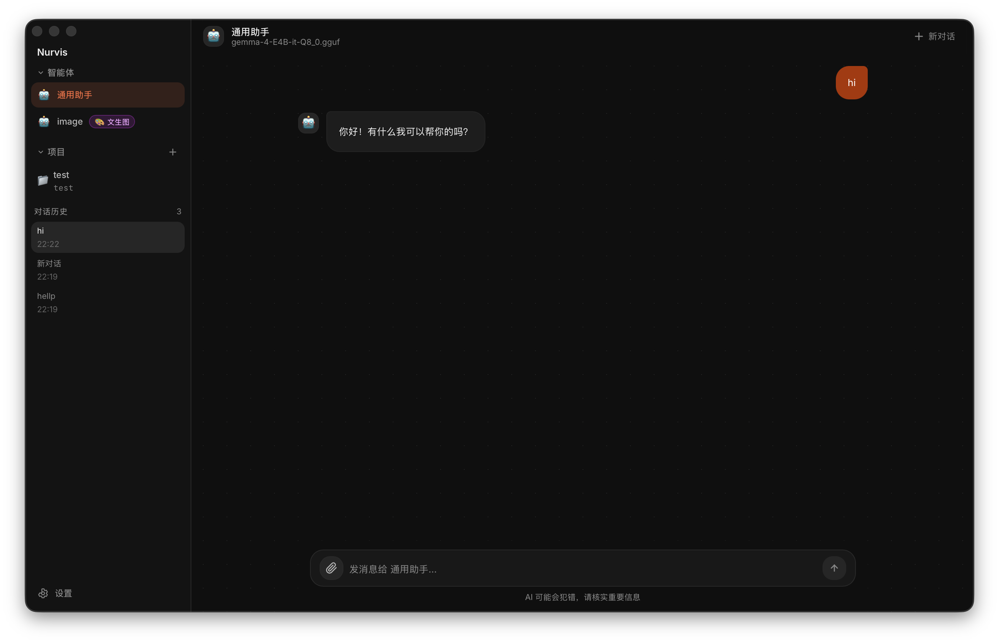
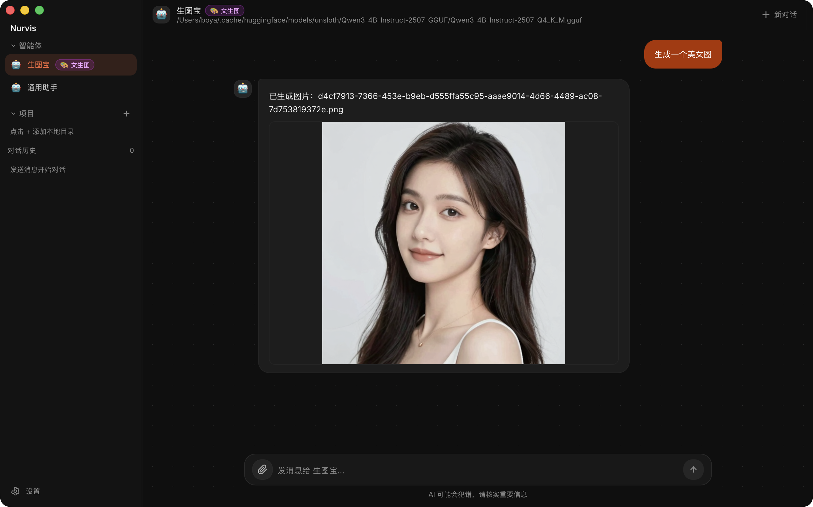
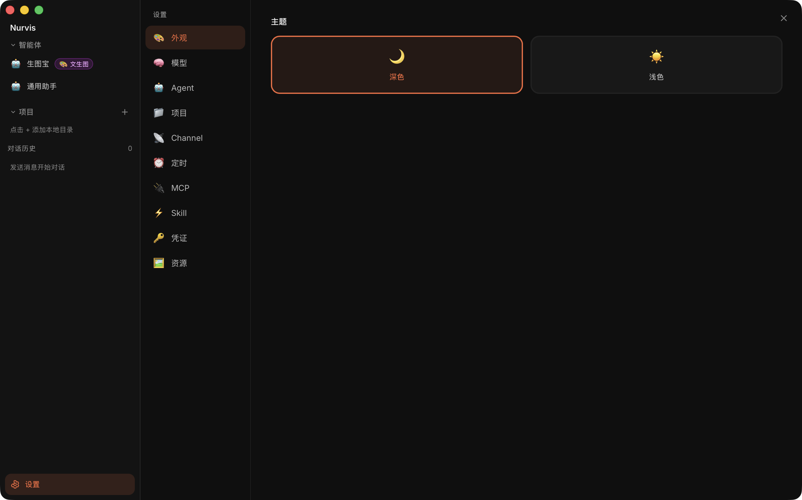
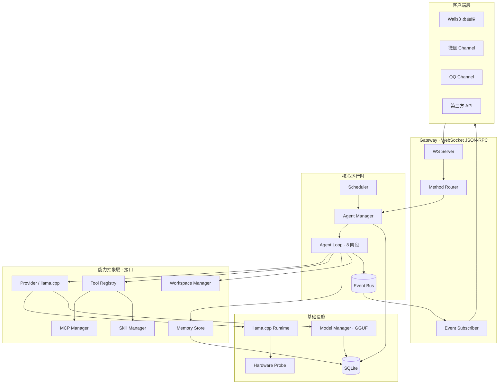
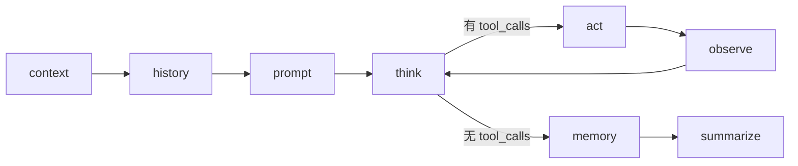

<div align="center">

# 🌌 Nurvis

### **本地优先的多 Agent 运行时**

*Local-First · Privacy-First · Multi-Agent Runtime*

[](https://go.dev)
[](https://github.com/ggerganov/llama.cpp)
[](https://v3.wails.io)
[](https://react.dev)
[](https://modernc.org/sqlite)
[](#)

**一切推理在本地进程内完成 · 数据不离电脑 · 多 Agent 多任务多渠道**

[✨ 特性](#-核心特性) · [🏗 架构](#-整体架构) · [🚀 快速开始](#-快速开始) · [📐 设计](#-核心抽象) · [🗺 路线图](#-路线图)

---

</div>

## 📸 预览

<div align="center">

### 主界面 · 多 Agent 流式对话


<br/><br/>

### 生成图片


<br/><br/>

### 设置界面 · Agent / 模型 / MCP / Skill / Channel 一站式管理


</div>

---

## 💡 它是什么

**Nurvis** 是一个类 OpenClaw 的本地优先 Agent 平台。核心直接基于 [llama.cpp](https://github.com/ggerganov/llama.cpp) 在进程内进行本地推理 —— **没有外部模型服务进程，没有云端 API，数据全程不离开你的电脑**。

同时支持创建多个 Agent，为不同任务（编程 / 画图 / 设计 / 写作 / 客服 …）绑定不同的模型、工具集、工作区与对话渠道（桌面 / 微信 / QQ）。

## ✨ 核心特性

**🔒 本地优先 / 隐私第一**
所有推理通过 `purego` 在进程内直接加载 `llama.cpp` 动态库完成，会话/配置/记忆全部落地 SQLite，免 CGO、免外部进程、零数据外泄。

**🧩 全面向接口的可扩展抽象**
Provider / Tool / Channel / Skill / MCP / Memory / Scheduler 全部接口化，新增实现只需注册，主流程零侵入。

**🤖 多 Agent 多任务**
每个 Agent = 「模型 + 系统提示 + 工具集 + 默认工作区 + 对话渠道」，互相隔离、独立配置。

**📡 统一 WebSocket JSON-RPC 网关**
桌面端、第三方 API、IM 渠道全部走单一入口，三类帧（`req` / `res` / `event`）协议简洁。

**🔭 全链路可观测**
Agent Loop 8 阶段（context → history → prompt → think → act → observe → memory → summarize）每阶段产生事件，经事件总线广播给前端流式渲染。

**🖥 现代桌面体验**
Wails3 + React 19 + Tailwind v4 + OKLCH 设计体系，原生窗口 + Web 渲染，深色 / 浅色双主题。

**🛠 丰富的工具生态**
内置工具（fs / exec / http）+ MCP（stdio / SSE / Streamable HTTP）+ Skill（指令包），三类工具适配为同一 `Tool` 接口注册到全局 Registry。

**📨 多渠道接入**
微信、QQ 等 IM 渠道作为 `Channel` 接入，入站调度器（去重 + 防抖）统一路由到对应 Agent + Session。

**⏰ 定时任务**
基于 `robfig/cron/v3` 的持久化定时任务，可让任意 Agent 在指定时间自主执行。

## 🧠 默认模型

首次启动会自动：
1. 探测硬件（内存 / GPU）；
2. 下载与本机匹配的 `llama.cpp` 动态库到 `~/.nurvis/lib`（macOS arm64 → Metal；Linux/Win → CUDA / Vulkan / CPU 自动挑选）；
3. 拉取默认模型 `gemma-3-4b-it-Q4_K_M.gguf` 到 `~/.nurvis/models`。

| 内存 / 显存 | 推荐模型                                                |
| ----------- | ------------------------------------------------------- |
| < 8 GB      | `gemma-3-1b-it-Q4_K_M` / `Qwen2.5-1.5B-Instruct-Q4_K_M` |
| 8 – 16 GB   | `gemma-3-4b-it-Q4_K_M` *（默认）*                       |
| 16 – 32 GB  | `gemma-3-12b-it-Q4_K_M` / `Qwen2.5-7B-Instruct-Q4_K_M`  |
| > 32 GB     | `gemma-3-27b-it-Q4_K_M`                                 |

工具调用解析支持多格式开箱即用：**Standard / Qwen / GLM / Mistral / Gemma / GPT / Phi-4** 等。

## 🏗 整体架构



## 🔁 Agent Loop · 8 阶段

每条用户消息触发一轮 Loop。`think → act → observe` 可循环多轮直到模型不再请求工具。



| 阶段          | 职责                                                        |
| ------------- | ----------------------------------------------------------- |
| **context**   | 装配运行上下文：Agent / Workspace / 工具白名单 / 模型参数   |
| **history**   | 拉取会话历史并按 token 预算裁剪                             |
| **prompt**    | 组装 system prompt：人设 + 工作区 + 工具 schema + 长期记忆  |
| **think**     | 流式推理，逐 token 经 bus 推给前端，结束后解析 `tool_calls` |
| **act**       | 通过 Tool Registry 并行执行工具调用，注入 `Scope`           |
| **observe**   | 工具结果回填为 `tool` 消息，决定是否再次 think              |
| **memory**    | 落库本轮消息，按规则抽取长期记忆                            |
| **summarize** | 历史超阈值时生成滚动摘要压缩 token                          |

## 🧱 核心抽象

| 接口                 | 角色                                                                  |
| -------------------- | --------------------------------------------------------------------- |
| **Provider**         | LLM 抽象，默认 llama.cpp 本地实现，预留 OpenAI 兼容                   |
| **Tool**             | 内置 / MCP / Skill 统一接口，注入 `Scope`（工作区 / agent / session） |
| **Channel**          | 对话渠道（微信 / QQ / 桌面），入站走 `channel.inbound` 事件           |
| **Bus**              | 泛型事件总线，串联 Loop 阶段 / 工具 / 渠道 / 调度器                   |
| **WorkspaceManager** | 本地目录工作区管理，文件类工具受根目录约束                            |
| **Memory**           | 会话历史 + 长期记忆（preference / fact / feedback）                   |

> 所有能力都收敛为少量稳定接口，主流程只依赖接口。**新增模型供应商、工具、渠道时只实现接口并注册，无需改 Loop。**

## 🛠 技术栈

| 维度     | 选型                                                                                      |
| -------- | ----------------------------------------------------------------------------------------- |
| 语言     | Go 1.22+（适当使用泛型）                                                                  |
| 存储     | SQLite (`modernc.org/sqlite`，纯 Go 免 CGO)                                               |
| 网关     | WebSocket (`coder/websocket`) + JSON-RPC 2.0                                              |
| LLM 推理 | [llama.cpp](https://github.com/ggerganov/llama.cpp) 动态库（`purego` 进程内调用，免 CGO） |
| 模型来源 | HuggingFace Hub（`*.gguf`，断点续传 + 进度推送）                                          |
| MCP      | 官方 `mcp-go` SDK（stdio / SSE / Streamable HTTP）                                        |
| 调度     | `robfig/cron/v3`                                                                          |
| 桌面     | Wails3                                                                                    |
| 前端     | React 19 + Vite + TypeScript + Tailwind CSS v4 + Zustand                                  |

## 🚀 快速开始

### 环境要求

- **Go** 1.22+
- **Node.js** 18+（前端构建）
- **macOS / Linux / Windows**（首启自动下载对应平台的 `llama.cpp` 库）

### 启动桌面端

```bash
# 克隆仓库
git clone https://github.com/zboya/nurvis.git
cd nurvis

# 拉取 vendor 依赖
go mod vendor

# 启动桌面调试模式
make desktop-dev
```

首次启动会引导你：
1. **硬件探测** → 自动下载 `llama.cpp` 动态库；
2. **模型推荐** → 根据内存 / GPU 拉取合适的 GGUF；
3. **创建第一个 Agent** → 选预设角色 / 命名 / 选 Emoji。

### 启动守护进程（无 GUI）

```bash
go run ./cmd/nurvisd
```

## 📂 目录结构

```
nurvis/
├── cmd/
│   ├── nurvisd/             # 守护进程入口
│   └── nurvis-desktop/      # Wails3 桌面端入口
├── internal/
│   ├── app/                 # 依赖装配 (wiring)
│   ├── gateway/             # WS JSON-RPC 网关
│   ├── agent/               # Agent Manager + 8 阶段 Loop
│   ├── provider/            # LLM Provider（llama.cpp / openai 兼容）
│   ├── backends/            # llama.cpp Runtime 封装
│   ├── modelmgr/            # 本地 GGUF 管理 + HF 下载
│   ├── hardware/            # 硬件探测
│   ├── tool/                # 工具接口 + 内置工具
│   ├── mcp/                 # MCP Manager
│   ├── skill/               # Skill Manager
│   ├── workspace/           # 工作区管理
│   ├── memory/              # 会话历史 + 长期记忆
│   ├── bus/                 # 泛型事件总线
│   ├── scheduler/           # cron 定时任务
│   ├── channel/             # 微信 / QQ 等渠道
│   └── store/               # SQLite + migrations + repo
└── frontend/                # React 19 + Tailwind v4
```

## 🌐 Gateway 协议（节选）

| 分组    | 方法                                                 |
| ------- | ---------------------------------------------------- |
| 对话    | `chat.send`, `chat.history`, `chat.abort`            |
| 会话    | `sessions.list/create/delete/label`                  |
| Agent   | `agents.list/create/update/delete`                   |
| 模型    | `models.list/library/pull/delete/recommend`          |
| 工具    | `tools.list`, `tools.builtin.toggle`                 |
| MCP     | `mcp.list/add/update/delete/grant`                   |
| Skill   | `skills.list/upload/toggle/grant`                    |
| Channel | `channels.list/create/update/delete/status`          |
| Cron    | `cron.list/create/delete/toggle/run/runs`            |
| 运行时  | `hardware.probe`, `runtime.status`, `runtime.ensure` |

事件推送：`agent.run.started/completed`、`agent.chunk`、`agent.stage`、`tool.call/result`、`runtime.lib.progress`、`models.pull.progress`、`channel.status`、`cron.fired`。

## 🗺 路线图

- [x] 骨架（store / bus / app wiring）
- [x] 本地推理就绪（llama.cpp Runtime + ModelManager）
- [x] llama.cpp Provider + Tool Registry + 内置工具
- [x] Agent Loop 8 阶段
- [x] WebSocket Gateway
- [x] Wails3 桌面端 + 引导流程
- [ ] MCP / Skill 全量接入
- [ ] Scheduler 持久化定时任务
- [ ] 微信 / QQ Channel 适配
- [ ] 多模态（VLM 图像理解 / 出图模型）

## 🤝 贡献

欢迎 Issue / PR！项目坚持几个原则：

- 接口先行，新增能力只增加实现不改主流程
- 单文件代码尽量不超过 1000 行（前后端皆然）
- 后台内置提示词与代码注释统一使用英文
- 环境变量使用 `NURVIS` 前缀

## 📜 License

MIT

---

## ⭐ Star History

<div align="center">

<a href="https://www.star-history.com/#github.com/zboya/nurvis&Date">
  <picture>
    <source media="(prefers-color-scheme: dark)" srcset="https://api.star-history.com/svg?repos=github.com/zboya/nurvis&type=Date&theme=dark" />
    <source media="(prefers-color-scheme: light)" srcset="https://api.star-history.com/svg?repos=github.com/zboya/nurvis&type=Date" />
    
  </picture>
</a>

</div>

---

<div align="center">

**Made with ❤️ for local-first AI**

*你的数据，永远只属于你*

</div>
